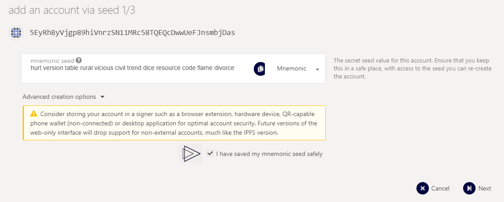
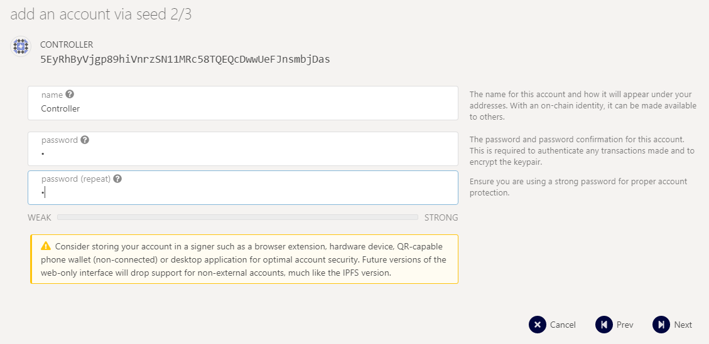
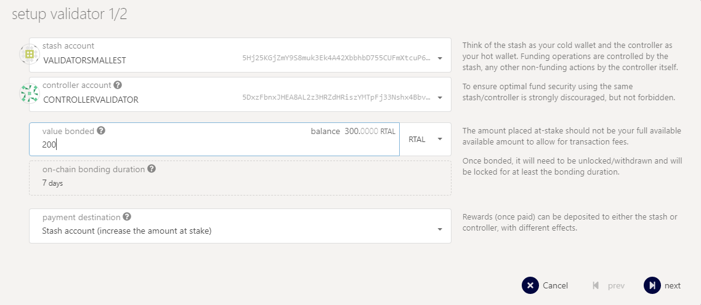

# **Setup Validator**

## Part 1 - Setup server components

## Requirements

The most common way for a beginner to run a validator is on a cloud server running Linux. You may choose whatever [VPS providers](#list-of-vps-providers) that your prefer, and whatever operating system you are comfortable with.

The transactions weights in Galital Testnet were benchmarked on standard hardware. It is recommended that validators run at least the standard hardware in order to ensure they are able to process all blocks in time. The following are not minimum requirements but if you decide to run with less than this beware that you might have performance issue.

### Minimum Hardware :

- 6GB ram, 60 GB Storage, 2 CPU , <strong>stable server uplink connection with fixed IP</strong>

### Ideal Hardware :

- 60GB ram, 300 GB Storage, 6 CPU, <strong>stable server uplink connection with fixed IP</strong>


## Using Ubuntu 20.04 : 

### Update your Ubuntu
```
sudo apt-get update
```

### Validator

Install & Configure Network Time Protocol (NTP) Client
NTP is a networking protocol designed to synchronize the clocks of computers over a network. NTP allows you to synchronize the clocks of all the systems within the network. Currently it is required that validators' local clocks stay reasonably in sync, so you should be running NTP or a similar service. You can check whether you have the NTP client by running:

If you are using Ubuntu 18.04 / 19.04 / 20.04, NTP Client should be installed by default.
```
timedatectl
```
If NTP is installed and running, you should see System clock synchronized: yes (or a similar message). If you do not see it, you can install it by executing:
```
sudo apt-get install ntp
```
ntpd will be started automatically after install. You can query ntpd for status information to verify that everything is working:
```
sudo ntpq -p
```

>WARNING: Skipping this can result in the validator node missing block authorship opportunities. If the clock is out of sync (even by a small amount), the blocks the validator produces may not get accepted by the network. This will result in ImOnline heartbeats making it on chain, but zero allocated blocks making it on chain. 
>


## Installing the Galital Testnet Binary

<br>

### Install and enable Chrony
Chrony is time synchronization service. It will keep time on server in sync, which is crucial for validator to operate without interruption.
```
sudo apt install chrony
sudo systemctl enable chrony
```

### Firewall configuration
Configure firewall ports to allow SSH and Validator service to communicate.
```
sudo ufw allow 22
sudo ufw allow 30333
sudo ufw enable
```

### Setup fail2ban
It provides basic-level protection against distributed brute-force attacks.
```
sudo apt install -y fail2ban && sudo systemctl enable fail2ban && sudo service fail2ban start
```

### Install Galital Validator binaries
```
wget https://github.com/starkleytech/galital/releases/download/2.0.1/galital && sudo chmod +x ./galital && sudo mv ./galital /usr/bin/galital
```

### Create user account to run Validator
It is recommended to run validator as non-root user.
For that create dedicated user account which will be used to run validator.
```
sudo adduser galital
```
when adding user you will be asked to provide password and some additional details for the account.
Only password is mandatory, other parameters can be left blank.

### Create Galital Validator service
Create service file file in /lib/systemd/system/tal.service
```
sudo nano /lib/systemd/system/galital.service
```

Content of galital.service file ***(make sure to change "A Node Name" and replace it with your moniker)***:
```
[Unit]
Description=Galital Validator
After=network-online.target

[Service]
ExecStart=/usr/bin/galital --port "30333" --name "A Node Name" --validator --chain galital   
User=galital
Restart=always
ExecStartPre=/bin/sleep 5
RestartSec=30s
LimitNOFILE=8192

[Install]
WantedBy=multi-user.target
```

> If you need to change port, you can setup with `--prometheus-port` `--rpc-port` and `--ws-port`

then start the service
```
sudo systemctl enable galital && sudo service galital start 
```

### Check if validator is started
To ensure that Galital Validator process works:
```
ps aux | grep galital
```

You should see similar output:
```
galital   8108  9.9 21.0 1117976 419772 ?      Ssl  May17 601:17 /usr/bin/galital --port 30333 --name "A Node Name" --validator --chain galital
```

Check if your node is appearing in the telemetry UI : [https://telemetry.polkadot.io/#list/Galital](https://telemetry.polkadot.io/#list/Galital)

> Do not forget to change the name parameter (--name "A Node Name")

***Video demonstrating all above steps: ***

<iframe width="800" height="600" src="https://www.youtube.com/embed/K7ZNKnu0sIs" title="YouTube video player" frameborder="0" allow="accelerometer; autoplay; clipboard-write; encrypted-media; gyroscope; picture-in-picture" allowfullscreen></iframe>

## Part 2 - Assign the node to an account

You can get some RTAL (Testnet token) with the discord bot

You need to create an controller account in order to do the next steps. 

>The stash account serve as you "cold wallet" with all your precious coin
>
>The controller account serve as a manager to your stash account
><br></br><strong>Always keep in safe place your keystore file or your 12/24 words seed</strong>

To create an controller account, add account


Save your mnemonic seed

 
then name your account and add a password
 

Then send some $RTAL (from your stash account) for covering network fees

You can proceed to the next steps

### Create session key:

Go in you terminal where the node is installed and paste the current command, you will have a session key of your node.

```
curl -H "Content-Type: application/json" -d '{"id":1, "jsonrpc":"2.0", "method": "author_rotateKeys", "params":[]}' http://localhost:9933
```

### Submitting the setKeys Transaction:

Go to the [testnet](https://polkadot.js.org/apps/?rpc=wss%3A%2F%2Fgalital-rpc-testnet.starkleytech.com#/staking/actions) you can now create a validator, use the key generated above to paste in the form.


Select your stash account, controller account and so one


Add you keys form the past command.


You should now see your validator in the waiting tab


***Video demonstrating all above steps:***
<iframe width="800" height="600" src="https://www.youtube.com/embed/JLZsAeqSD2g" title="YouTube video player" frameborder="0" allow="accelerometer; autoplay; clipboard-write; encrypted-media; gyroscope; picture-in-picture" allowfullscreen></iframe>


## Part 3 - Set on-chain name of the validator

Short video guide demonstrating how to assign name to validator.

<iframe width="800" height="600" src="https://www.youtube.com/embed/8ES8-eg70eI" title="YouTube video player" frameborder="0" allow="accelerometer; autoplay; clipboard-write; encrypted-media; gyroscope; picture-in-picture" allowfullscreen></iframe>


Voila, you are all set

<br></br>

<p align=right> Written by Masterdubs & WeHaveCookie </p>
